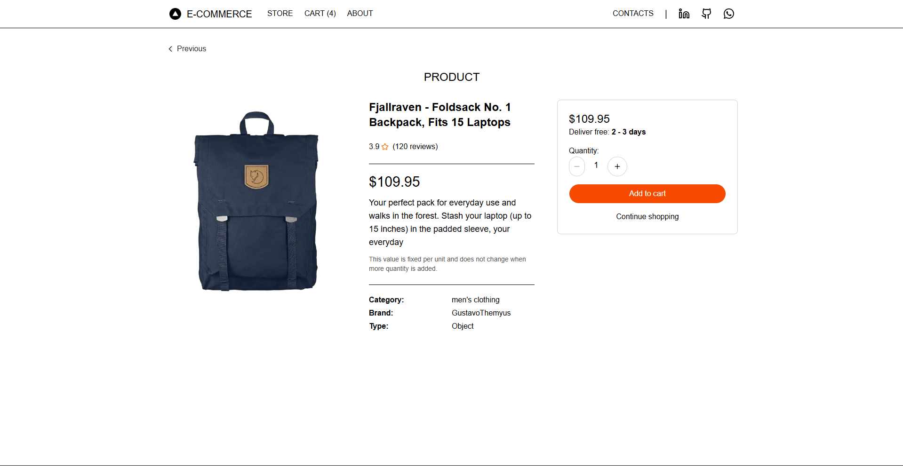
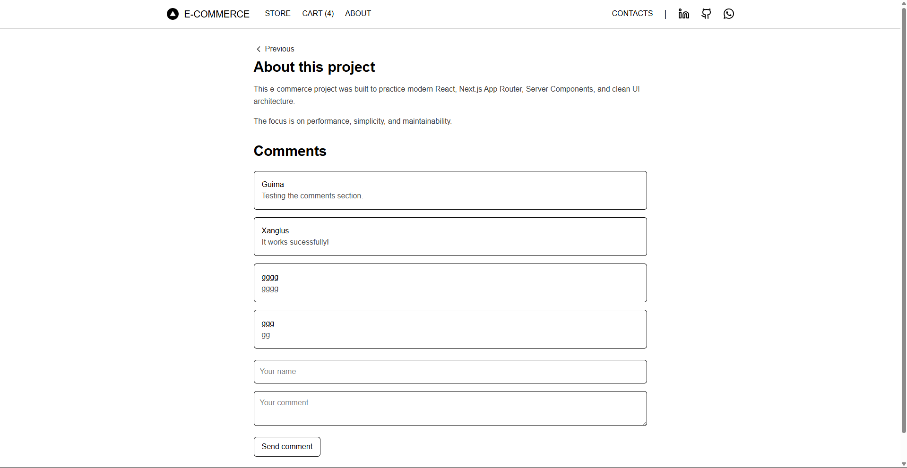

# E-Commerce  
  
**A simple and modern e-commerce application focused on product listing and shopping cart experience.**  
**Built with Next.js (App Router), using Tailwind CSS for a clean, responsive interface.**  
**Products are fetched from an external API, and cart data is stored in Local Storage for persistence.**  

### Features
- 🛍️ **Product listing:** browse products fetched dynamically from an external API.
- 🔍 **View product details:** access individual product pages with full information.
- ➕ **Add to cart:** add products to the shopping cart with quantity control.
- 🧮 **Dynamic pricing:** total price updates automatically based on quantity.
- 🛒 **Persistent cart:** cart data is saved in localStorage and persists after reload.
- ⚡ **Smooth navigation:** fast page transitions powered by Next.js App Router.
  
### Technologies
- **Next.js** — App Router, Server Components, and Client Components
- **React** — Component-based UI and state management
- **Tailwind CSS** — Clean, responsive, and modern styling 
- **Lucide React** — Consistent and lightweight icons 
- **Context API** — Global cart state management  
- **Fetch API** — Data fetching from external product API
- **LocalStorage API** — Persistent shopping cart storage
- **Vercel** — Deployment and hosting  
  
### 🌐 Live Demo
#### The project is deployed and can be accessed at:  
👉 [Run the project](https://e-commerce-ruby-mu-84.vercel.app/)  
  
#### Try browsing products, viewing details, and adding items to the cart directly in your browser — no local setup required.

  

  

  

  

